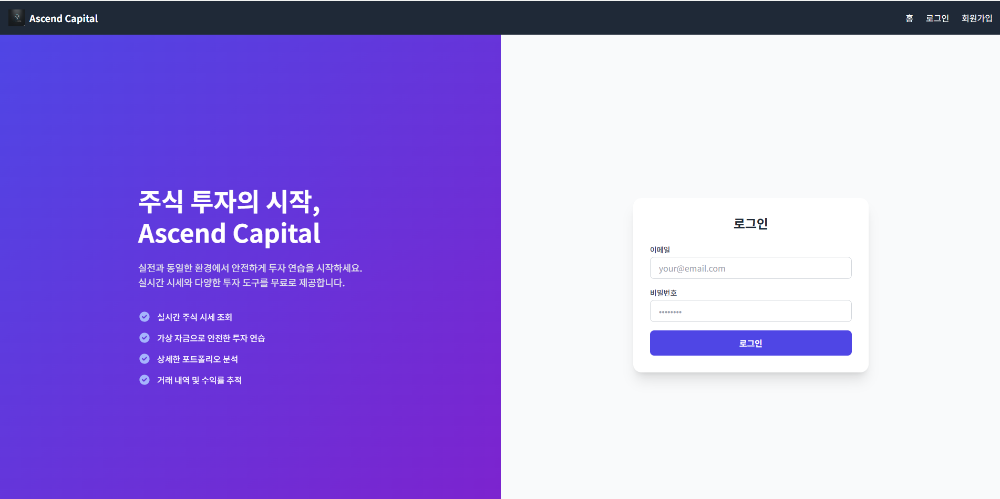
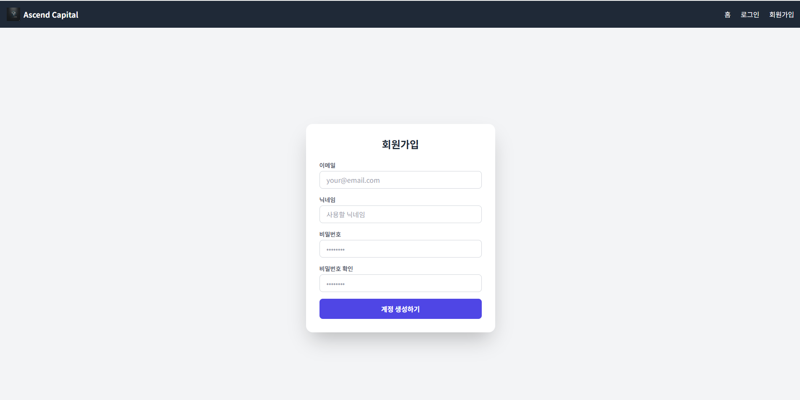
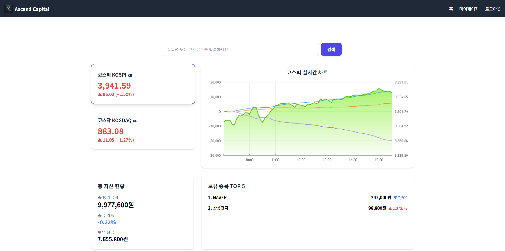
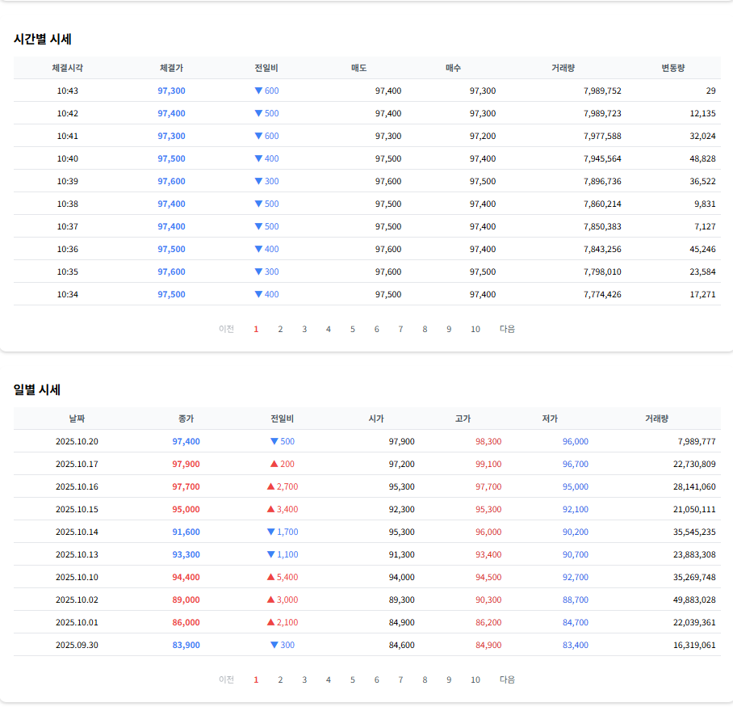
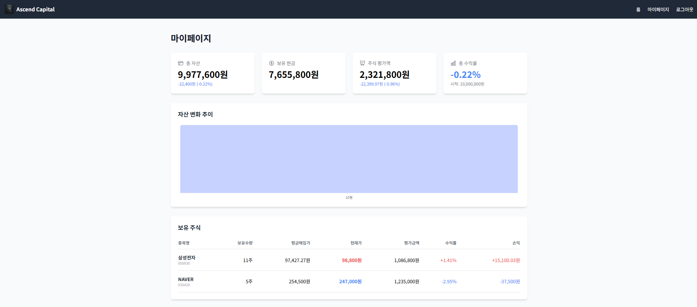
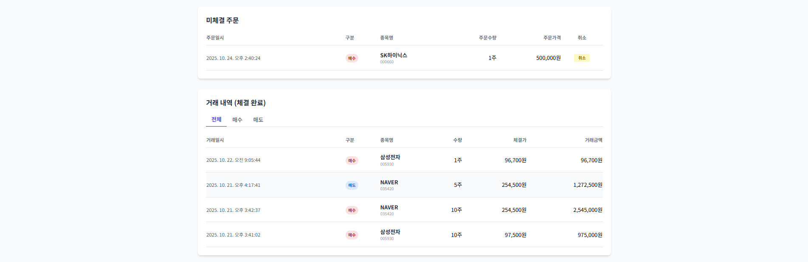
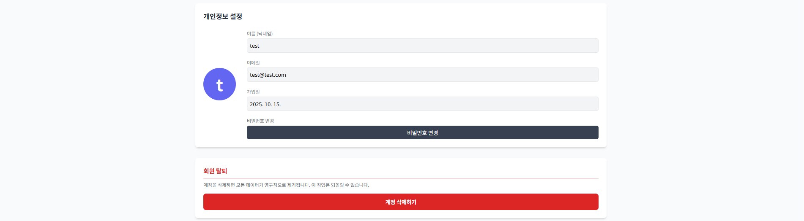

# 🏦 핀테크 백엔드 개발자 포트폴리오

> **"금융 서비스의 안정성과 확장성을 고민하는 백엔드 개발자입니다."**

---

### 🧭 About Me

- 💡 **Python/Django 기반 핀테크 백엔드 개발자**
- 💼 금융(증권) 서비스의 **정확한 데이터 처리와 안정성**에 집중
- 🧠 “꼼꼼하고 주도적인 문제 해결형 개발자”
- 🧩 주요 프로젝트: **모의 주식 거래 플랫폼 ‘Ascend Capital’**
- ⚙️ **CI/CD 자동화 + 테스트 커버리지 80%** 달성

---

### 🛠 Tech Stack

#### 🧩 Backend

#### ☁ Infrastructure

#### 💻 Frontend

#### 🧰 Tools

---

## 🚀 Project: Ascend Capital (모의 주식 거래 플랫폼)

> **Django/DRF를 활용해 실제 주식 거래소의 핵심 기능을 구현한 1인 개발 프로젝트**  
> 핀테크 서비스에 필수적인 안정적인 API, 데이터베이스 설계, 비동기 작업 및 배치 처리에 집중

- **📅 개발 기간**: 2025.10.13 ~ 2025.10.25
- **💻 개발 형태**: 1인 풀스택 개발

---

### 🧩 주요 기능

- **사용자**
  - 회원가입, 로그인, 마이페이지 (개인정보 수정, 회원 탈퇴)
- **주식**
  - 실시간 지수(코스피/코스닥), 종목 검색(이름/코드), 상세 정보(차트, 호가, 시세)
- **거래**
  - 매수/매도 (지정가/시장가), 미체결 주문 내역, 거래 내역 (체결 완료)
- **자산**
  - 총자산, 보유 현금, 주식 평가액, 수익률, 자산 변화 추이

---

### 🖼 구현 화면

| 로그인                       | 회원가입                         | 홈페이지                         |
| ---------------------------- | -------------------------------- | -------------------------------- |
|  |  |  |

| 주식 상세 1                                    | 주식 상세 2                                    | 마이페이지                           |
| ---------------------------------------------- | ---------------------------------------------- | ------------------------------------ |
|  |  |  |

| 마이페이지 2                           | 마이페이지 3                           |
| -------------------------------------- | -------------------------------------- |
|  |  |

---

## ⚙ Backend Architecture & 핵심 역량

### 1️⃣ Django REST API 개발

- DRF 기반 RESTful API 설계
- 모듈식 앱 구조 (`users`, `stocks`, `trading`)
- JWT/세션 기반 인증 및 인가 구현
- 효율적인 직렬화(Serializer) 및 응답 구조 설계

### 2️⃣ Database 설계 및 관리

- 금융 서비스에 최적화된 RDB 모델링
- `User`, `Stock`, `Holding`, `Order`, `Transaction` 관계 설계
- 트랜잭션 기반 데이터 정합성 보장
- PostgreSQL 기반 데이터 관리

### 3️⃣ 외부 데이터 수집 및 비동기 처리

- `Django Management Command`를 통한 주식 데이터 자동 크롤링
- 네이버 페이 증권 데이터 스크래핑 및 DB 업데이트
- `pykrx` 기반 실제 거래일 기준 자산 스냅샷 생성
- `Celery` 기반 비동기 주문 처리 및 스케줄링

### 4️⃣ DevOps & CI/CD

- `Docker` / `docker-compose`로 개발 환경 컨테이너화 (Django, DB, React)
- **GitHub Actions 기반 CI 파이프라인 구축 완료**
  - ✅ **Backend-Check:** `flake8`, `black`, `isort` 린팅 통과
  - ✅ **Backend-Test:** 단위 테스트 + **테스트 커버리지 80% 이상**
  - ✅ **Frontend-Check:** `eslint` 및 프로덕션 빌드 성공
- Main 브랜치 통합 전 자동화된 코드 품질 검증 보장

---
