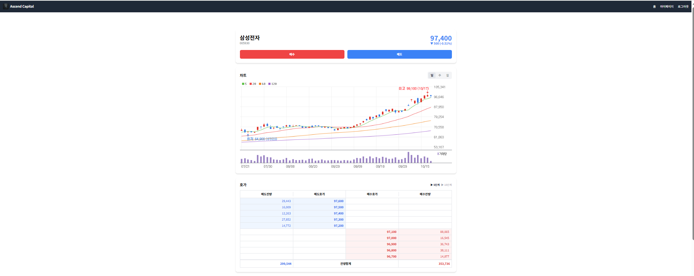

# 🏦 핀테크 백엔드 개발자 포트폴리오

> **"금융 서비스의 안정성과 확장성을 고민하는 백엔드 개발자입니다."**

---

### 🧭 About Me

- 💡 **Python/Django 기반 핀테크 백엔드 개발자**
- 💼 금융(증권) 서비스의 **정확한 데이터 처리와 안정성**에 집중
- 🧠 “꼼꼼하고 주도적인 문제 해결형 개발자”
- 🧩 주요 프로젝트: **모의 주식 거래 플랫폼 ‘Ascend Capital’**
- ⚙️ **CI/CD 자동화 + 테스트 커버리지 80%** 달성

---

### 🛠 Tech Stack

#### 🧩 Backend

  
  
  

#### ☁ Infrastructure

  
  
  
  

#### 💻 Frontend

  

#### 🧰 Tools

  

---

## 🚀 Project: Ascend Capital (모의 주식 거래 플랫폼)

> **Django/DRF를 활용해 실제 주식 거래소의 핵심 기능을 구현한 1인 개발 프로젝트**  
> 핀테크 서비스에 필수적인 안정적인 API, 데이터베이스 설계, 비동기 작업 및 배치 처리에 집중

- **📅 개발 기간**: 2025.10.13 ~ 2025.10.25
- **💻 개발 형태**: 1인 풀스택 개발
- **🌐 실제 배포 주소**: [http://15.164.164.166/] _(AWS EC2 + Terraform + GitHub Actions 기반 자동 배포)_

### 🔑 로그인 정보 (테스트 계정 로그인하지 않으면 화면에 데이터 로딩 실패: No refresh token available.라고 뜸)

- **ID**: `test2@test.com`
- **PW**: `12345678`

---

### 🧩 주요 기능

- **사용자**

  - 회원가입, 로그인, 마이페이지 (개인정보 수정, 회원 탈퇴)

- **주식**

  - 실시간 지수(코스피/코스닥), 종목 검색(이름/코드), 상세 정보(차트, 호가, 시세)

- **거래**

  - 매수/매도 (지정가/시장가), 미체결 주문 내역, 거래 내역 (체결 완료)

- **자산**
  - 총자산, 보유 현금, 주식 평가액, 수익률, 자산 변화 추이

---

### 🖼 구현 화면

| 로그인                       | 회원가입                         | 홈페이지                         |
| ---------------------------- | -------------------------------- | -------------------------------- |
|  |  |  |

| 주식 상세 1                                    | 주식 상세 2                                    | 마이페이지                           |
| ---------------------------------------------- | ---------------------------------------------- | ------------------------------------ |
|  |  |  |

| 마이페이지 2                           | 마이페이지 3                           |
| -------------------------------------- | -------------------------------------- |
|  |  |

---

## ⚙ Backend Architecture & 핵심 역량

### 1️⃣ Django REST API 개발

- DRF 기반 RESTful API 설계
- 모듈식 앱 구조 (`users`, `stocks`, `trading`)
- JWT/세션 기반 인증 및 인가 구현
- 효율적인 직렬화(Serializer) 및 응답 구조 설계

### 2️⃣ Database 설계 및 관리

- 금융 서비스에 최적화된 RDB 모델링
- `User`, `Stock`, `Holding`, `Order`, `Transaction` 관계 설계
- 트랜잭션 기반 데이터 정합성 보장
- PostgreSQL 기반 데이터 관리

### 3️⃣ 외부 데이터 수집 및 비동기 처리

- `Django Management Command`를 통한 주식 데이터 자동 크롤링
- 네이버 페이 증권 데이터 스크래핑 및 DB 업데이트
- `pykrx` 기반 실제 거래일 기준 자산 스냅샷 생성
- `Celery` 기반 비동기 주문 처리 및 스케줄링

### 4️⃣ DevOps & CI/CD

- `Docker` / `docker-compose`로 개발 환경 컨테이너화 (Django, DB, React)
- **GitHub Actions 기반 CI 파이프라인 구축 완료**
  - ✅ **Backend-Check:** `flake8`, `black`, `isort` 린팅 통과
  - ✅ **Backend-Test:** 단위 테스트 + **테스트 커버리지 80% 이상**
  - ✅ **Frontend-Check:** `eslint` 및 프로덕션 빌드 성공
- Main 브랜치 통합 전 자동화된 코드 품질 검증 보장

### 5️⃣ 트러블슈팅 강조 경험: 백엔드 API 성능 개선 (N+1 문제 해결)

#### 1. 문제 상황: 포트폴리오 로딩 속도 저하 🐢

**프로젝트명**: Ascend Capital (모의 주식 투자 및 포트폴리오 관리 사이트)

**개요**:  
사용자의 포트폴리오 데이터를 보여주는 마이페이지 및 대시보드 화면에서 초기 로딩 시간이 5초 이상 (측정치: 5,218ms) 소요되는 심각한 성능 문제가 발생했습니다. 이는 사용자 경험(UX)을 크게 저해하는 요인이었습니다.

**원인 분석: "N+1" API 호출 패턴**  
페이지 로딩 시 다음과 같은 비효율적인 API 호출 패턴이 확인되었습니다.

- **1차 호출 (목록 조회)**: 프론트엔드에서 `/api/trading/portfolio/` API를 호출하여 사용자가 보유한 주식 목록 (종목 코드, 보유 수량, 평단가 등)을 가져옵니다. (1번 호출)
- **2차 호출 (개별 상세 조회)**: 1번 응답에서 받은 N개의 각 보유 주식에 대해, 실시간 현재가, 평가금액, 수익률 등을 계산하기 위해 `/api/stocks/detail/{stock_code}/` (또는 유사한 현재가 조회 로직)을 N번 추가 호출합니다.

이로 인해 사용자가 10개 종목을 보유하고 있다면, 포트폴리오 화면을 완전히 렌더링하기 위해 총 **11번 (1 + 10)**의 네트워크 왕복이 발생했습니다. 각 호출에는 네트워크 지연 시간과 백엔드 처리 시간이 포함되므로, 보유 종목 수가 많아질수록 로딩 시간은 급격히 증가하는 구조였습니다.

#### 2. 해결 과정: API 응답 통합 및 최적화 🚀

**목표**: "N+1" 호출을 단 1번의 API 호출로 줄여 네트워크 오버헤드를 최소화하고, 백엔드 로직을 최적화하여 응답 속도를 2초 이내로 단축한다.

**구현 전략**:

- **책임 이동 (Serializer → View)**:  
  기존에는 `PortfolioSerializer`의 `SerializerMethodField` 내부에서 각 항목마다 실시간 가격 조회 함수(`get_current_stock_price_for_trading`)를 호출했습니다. 이 가격 조회 책임을 API View (`PortfolioListView`)로 이동했습니다.

- **가격 정보 사전 조회 (Pre-fetching) in View**:  
  `PortfolioListView`의 `list` 메서드를 오버라이드했습니다.

  - 쿼리셋(`get_queryset`) 실행 후, 응답에 필요한 모든 종목 코드를 미리 추출했습니다.
  - Python의 `concurrent.futures.ThreadPoolExecutor`를 사용하여 추출된 종목 코드들에 대한 현재가 조회를 병렬로 실행했습니다. 이는 다수의 웹 스크래핑 요청(또는 외부 API 호출)을 동시에 처리하여 전체 조회 시간을 획기적으로 단축시킵니다.
  - 조회된 가격 정보 (종목 코드: 가격)를 `price_cache` 딕셔너리에 저장했습니다.

- **Serializer에 Context 전달**:  
  View에서 생성한 `price_cache`를 serializer context를 통해 `PortfolioSerializer`로 전달했습니다.

- **Serializer 로직 수정**:  
  `PortfolioSerializer`에서 `SerializerMethodField`와 관련 `get_...` 메서드들을 모두 제거했습니다.
  - `current_price`, `total_value`, `profit_loss`, `profit_loss_rate` 필드를 `serializers.DecimalField`, `serializers.FloatField`로 명시적으로 선언했습니다. (JSON 변환 타입 지정)
  - `to_representation` 메서드를 오버라이드하여, context에서 `price_cache`를 받아 캐시된 가격을 사용해 실시간 평가금액, 손익, 수익률을 직접 계산하고 최종 응답 데이터(representation)에 포함시켰습니다.

#### 3. 결과 및 기대 효과 ✨

**성능 측정 결과 (API 응답 속도)**:  
로직 수정 전 5,218ms (약 5.2초)였던 포트폴리오 API 응답 시간이, 최적화 이후 1,880ms (약 1.9초)로 약 64% 단축되었습니다.

**API 호출 횟수**:  
기존 N+1 회 → 1회로 획기적으로 감소.

**네트워크 지연**:  
불필요한 네트워크 왕복이 모두 제거되어 로딩 시간 단축에 결정적으로 기여했습니다.

**백엔드 효율성**:  
가격 조회 로직이 View로 집중되고 `ThreadPoolExecutor`를 통해 병렬 처리되어 백엔드 응답 속도가 크게 개선되었습니다. Serializer는 전달받은 데이터를 계산만 하므로 역할이 명확해지고 테스트 용이성이 증가했습니다.

**사용자 경험 (UX)**:  
마이페이지 및 대시보드의 체감 로딩 속도가 목표치인 2초 이내로 개선되어, 사용자가 쾌적하게 핵심 기능을 이용할 수 있게 되었습니다.

**결론**  
API 응답 구조를 최적화하고 백엔드 로직에서 병렬 처리를 도입하여 고질적인 "N+1" 문제를 효과적으로 해결했습니다. 특히 API 응답 시간을 5,218ms에서 1,880ms로 단축시킨 구체적인 성능 측정을 통해 개선 효과를 입증했습니다. 이를 통해 네트워크 병목 현상을 제거하고 사용자 경험을 크게 향상시킬 수 있었습니다. 이번 경험을 통해 효율적인 API 설계와 백엔드 성능 최적화의 중요성을 다시 한번 확인했습니다.

---

## # Ascend Capital **CI/CD 파이프라인**

**Terraform, GitHub Actions, AWS EC2를 활용한 Full-Stack CI/CD 파이프라인 및 인프라 자동화 구축**

### 1. 프로젝트 개요

이 프로젝트는 Django REST Framework(백엔드)와 React/Vite(프론트엔드)로 구성된 풀스택 가상 주식 거래 애플리케이션입니다.

단순한 기능 구현을 넘어, **개발자가 `main` 브랜치에 코드를 푸시(Push)하는 순간부터 AWS의 실제 운영 서버에 자동으로 배포**되기까지의 전 과정을 자동화하는 것을 목표로 했습니다.

이를 위해 **Terraform(IaC)**을 사용하여 AWS 인프라를 코드로 관리하고, **GitHub Actions**를 활용하여 CI(지속적 통합) 및 CD(지속적 배포) 파이프라인을 구축했습니다.

### 2. 핵심 아키텍처

_(위 다이어그램은 이 프로젝트의 아키텍처를 시각화한 예시입니다.)_

- **Infra as Code (IaC):** `Terraform`
- **Cloud Provider:** `AWS`
- **CI/CD:** `GitHub Actions`
- **Web Server (Reverse Proxy):** `Nginx`
- **Application Server (WSGI):** `Gunicorn`
- **Backend:** `Django`, `Python`
- **Frontend:** `React (Vite)`, `TypeScript`
- **Database:** `AWS RDS (PostgreSQL)`
- **Process Management:** `Systemd`

### 3. 주요 기술 및 구현 기능

#### 3.1. 인프라 (AWS & Terraform)

- **Terraform (IaC):** AWS 콘솔에서 수동으로 클릭하는 대신, 모든 인프라(EC2, RDS, 보안 그룹)를 코드로 선언하고 `terraform apply` 명령어로 자동 생성 및 관리했습니다.
- **VPC 및 네트워킹:** `aws_security_group`을 사용하여 프론트엔드(80/443), 백엔드(SSH), 데이터베이스(5432) 간의 접근을 엄격히 통제하는 방화벽 규칙을 코드로 정의했습니다.
- **EC2 (Application Server):** `aws_instance` 리소스를 사용하여 Nginx, Gunicorn, React 빌드 환경이 설치된 Ubuntu 서버를 프로비저닝했습니다.
- **RDS (Database):** `aws_db_instance` 리소스를 사용하여 백엔드 전용 관리형 PostgreSQL 데이터베이스를 구축했습니다.
- **`user_data`를 통한 서버 초기화:** EC2 인스턴스 부팅 시 `user_data` 스크립트를 실행하여, Nginx/Python/Node.js 설치, `git clone`, Nginx 및 `systemd` 서비스 파일 생성 등 CD를 받을 수 있는 "뼈대"를 자동으로 구축했습니다.

#### 3.2. 자동화 (GitHub Actions CI/CD)

- **CI (지속적 통합):**
  - `main` 브랜치에 Push 또는 PR 발생 시, `backend-check`와 `frontend-check` 잡(Job)이 병렬로 실행됩니다.
  - **Backend:** `services` 컨테이너(PostgreSQL, Redis)를 띄워, `flake8` 린팅, `coverage` 기반 단위 테스트를 통과해야만 성공합니다.
  - **Frontend:** `ESLint` 린팅 및 `npm run build`를 통과해야만 성공합니다.
- **CD (지속적 배포):**
  - CI의 모든 잡이 성공하면 `deploy` 잡이 자동으로 트리거됩니다.
  - `appleboy/ssh-action`을 사용해 GitHub Actions 러너가 `Terraform`으로 생성한 EC2 서버에 SSH로 원격 접속합니다.
  - `deploy` 스크립트가 EC2 서버 내부에서 다음을 순차적으로 실행합니다.
    1. `git pull`로 최신 소스 코드를 가져옵니다.
    2. 백엔드 의존성(`pip install`) 및 DB 마이그레이션(`migrate`)을 실행합니다.
    3. 프론트엔드 의존성(`npm ci`) 및 프로덕션 빌드(`npm run build`)를 실행합니다.
    4. `systemctl restart gunicorn` 명령으로 Gunicorn 서비스를 재시작하여 무중단에 가깝게 새 코드를 적용합니다.

### 4. 직면한 주요 과제 및 해결 과정 (Debugging)

배포 과정은 단순한 스크립트 실행이 아닌, 운영 환경의 복잡한 문제를 해결하는 과정이었습니다.

#### 과제 1: Terraform 프로비저닝 오류 (IaC)

- **문제:** `terraform apply` 실행 시, RDS에서 `admin` 사용자 생성이 거부되고, EC2에서 `InvalidAMIID` 오류가 발생했습니다.
- **진단:** AWS RDS는 `admin`을 예약어로 사용하며, AMI ID는 리전(Region)마다 고유하다는 것을 파악했습니다.
- **해결:** `terraform.tfvars`의 `db_username`을 `ascend_admin`으로 변경하고, `main.tf`의 `provider`가 `ap-northeast-2` (서울)로 설정된 것을 확인 후, AWS 콘솔 **서울 리전**에서 최신 Ubuntu 22.04의 `ami-` ID를 찾아 코드를 수정하여 성공적으로 인프라를 구축했습니다.

#### 과제 2: "Permission Denied" (파일 소유권 충돌)

- **문제:** CD 스크립트가 EC2에서 `git pull` 및 `npm ci` 실행 시 "dubious ownership" 및 "permission denied" 오류로 실패했습니다.
- **진단:** `user_data` (서버 구축)는 `root` 사용자로 실행되어 `/home/ubuntu/AscendCapital` 폴더의 소유자가 `root`가 되었습니다. 반면, `deploy` (배포) 스크립트는 `ubuntu` 사용자로 SSH 접속하여 `root` 소유의 폴더에 쓰기를 시도했기 때문에 충돌이 발생했습니다.
- **해결:** `ci.yml`의 `deploy` 스크립트 **최상단**에 `sudo chown -R ubuntu:ubuntu /home/ubuntu/AscendCapital` 및 `git config --global --add safe.directory ...` 명령을 추가하여, 배포 실행 직전에 폴더 소유권을 `ubuntu` 사용자에게 강제로 가져온 후 `git pull`을 실행하도록 하여 문제를 해결했습니다.

#### 과제 3: `migrate` 및 `npm run build` 연쇄 실패 (환경 변수)

- **문제:** `deploy` 스크립트에서 `python manage.py migrate`는 `localhost` DB로 접속을 시도하며 실패했고, `npm run build`는 `tsc: not found` 오류로 실패했습니다. (결과적으로 `dist` 폴더가 생성되지 않아 Nginx 500 오류 발생)
- **진단:** `Permission Denied` 문제로 `npm ci`가 실패하여 `tsc`가 설치되지 않았고, `migrate` 명령어는 `systemd`와 달리 `.env` 파일을 자동으로 읽지 못해 RDS 주소를 알지 못했습니다.
- **해결:** `deploy` 스크립트의 `migrate` 명령어 **직전에** `set -o allexport; source .env; set +o allexport` 명령을 추가하여, 셸 세션에 `.env` 파일의 모든 변수(RDS 주소 등)를 강제로 주입시켰습니다. (1번의 권한 문제 해결 후 `npm ci`도 정상화되어 `dist` 폴더가 생성되었습니다.)

#### 과제 4: React 앱 API 요청 오류 (`127.0.0.1` vs `EC2_IP`)

- **문제:** 웹사이트 접속은 성공했으나, React 앱이 API를 `http://127.0.0.1:8000` (로컬)로 요청하여 `ERR_CONNECTION_REFUSED`가 발생했습니다.
- **진단:** React(Vite)의 `axios` 인스턴스에 `baseURL`이 `127.0.0.1`로 하드코딩되어 있었습니다.
- **해결:**
  1. `axiosInstance.ts`의 `baseURL`을 Vite의 환경 변수인 `import.meta.env.VITE_API_BASE_URL`로 변경했습니다.
  2. `frontend-vite` 폴더에 `.env.development` (로컬용: `VITE_API_BASE_URL=http://127.0.0.1:8000`)와 `.env.production` (배포용: `VITE_API_BASE_URL=/`) 파일을 생성했습니다.
  3. CD의 `npm run build`는 자동으로 `.env.production`을 참조하여 `baseURL`이 `/` (상대 경로)로 빌드되었고, 모든 API 요청이 EC2 서버의 공인 IP로 정상적으로 전송되었습니다.

#### 과제 5: "검색 결과가 없습니다" (빈 데이터베이스)

- **문제:** `migrate`까지 성공했지만, 주식 검색 시 API는 `200 OK`를 반환하는데 데이터가 없어 검색 결과가 나오지 않았습니다.
- **진단:** `migrate`는 테이블의 "뼈대"만 생성할 뿐, 실제 주식 데이터를 채워주지 않았습니다.
- **해결:** EC2 서버에 수동으로 접속하여, Django 관리 명령어인 `python manage.py crawl_stocks`를 1회 실행하여 RDS 데이터베이스에 주식 종목 데이터를 초기화했습니다.

### 5. 프로젝트 성과 및 배운 점

**성과:** 코드를 `main` 브랜치에 푸시하면 약 3~5분 이내에 자동으로 테스트, 빌드, AWS EC2 서버 배포까지 완료되는 **완전 자동화된 Full-Stack CI/CD 파이프라인**을 완성했습니다.

**배운 점:**

- **인프라 추상화:** Terraform을 통해 "서버"라는 물리적 개념을 "코드"라는 논리적 개념으로 다루는 IaC의 강력함을 경험했습니다.
- **환경 분리의 중요성:** 로컬(`.env.development`), CI(`services`), 프로덕션(`.env.production`, EC2 `.env`) 환경이 모두 다르다는 것을 인지하고, Vite 환경 변수와 `source .env` 셸 기법을 통해 이를 분리하고 제어하는 방법을 배웠습니다.
- **권한 및 소유권:** 리눅스 환경에서 `root` 사용자와 `ubuntu` 사용자의 권한 충돌은 배포 자동화의 가장 큰 장애물이지만, `chown`과 `safe.directory` 설정으로 해결할 수 있음을 배웠습니다.
- **체계적인 디버깅:** `500 Internal Server Error`라는 모호한 오류를 만났을 때, Nginx 로그(`redirection cycle`) → Gunicorn 로그(`relation does not exist`) → `ls -l` (파일 없음) → GitHub Actions 로그 (`npm build` 실패) 순서로 **요청의 흐름을 역추적**하며 근본 원인을 찾아내는 문제 해결 역량을 길렀습니다.

---
